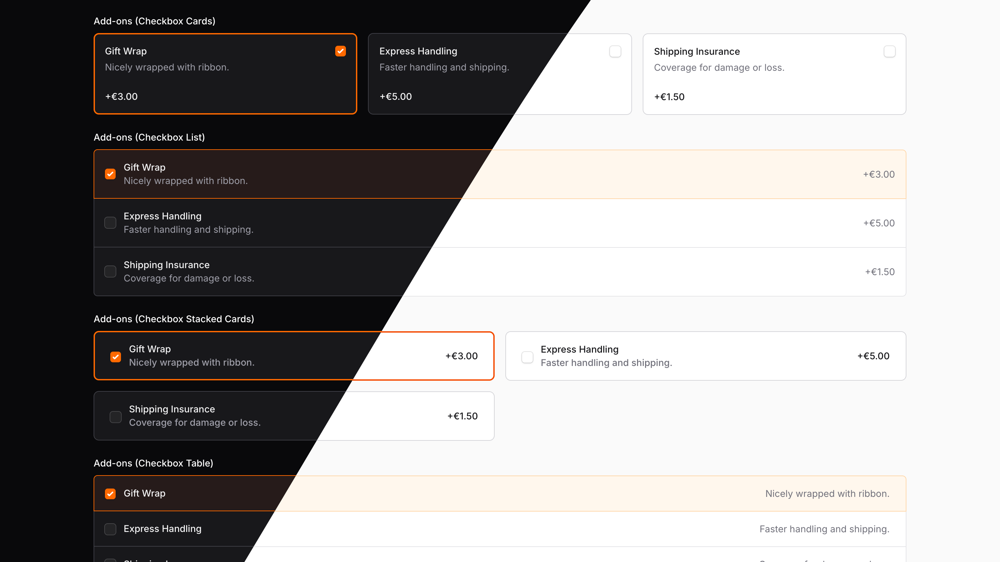
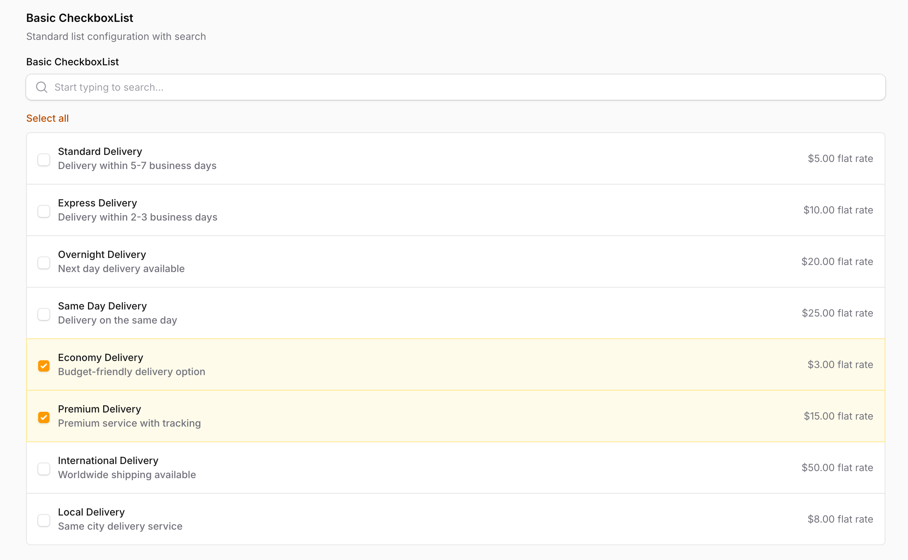
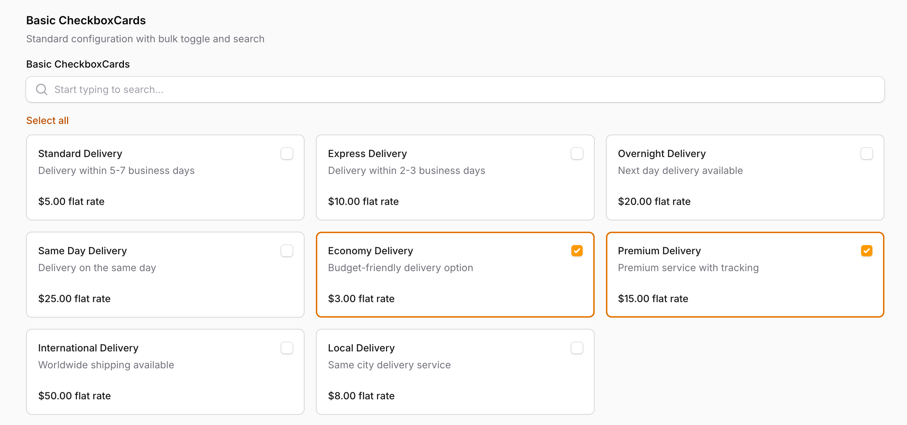
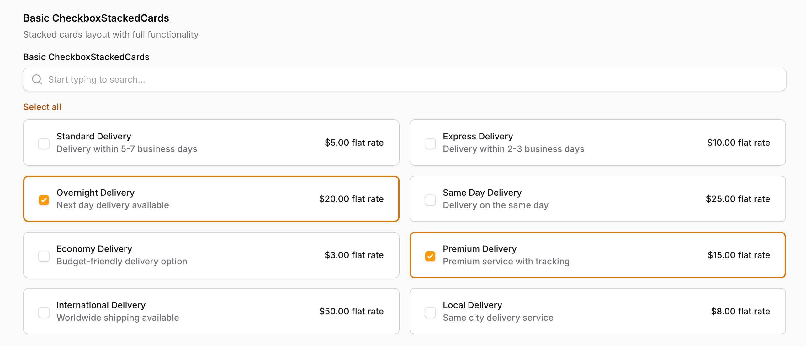
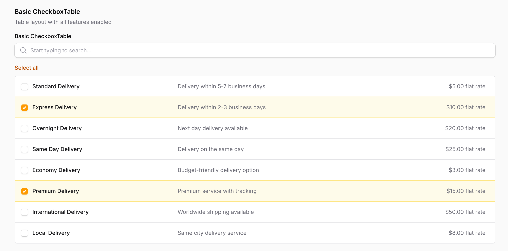
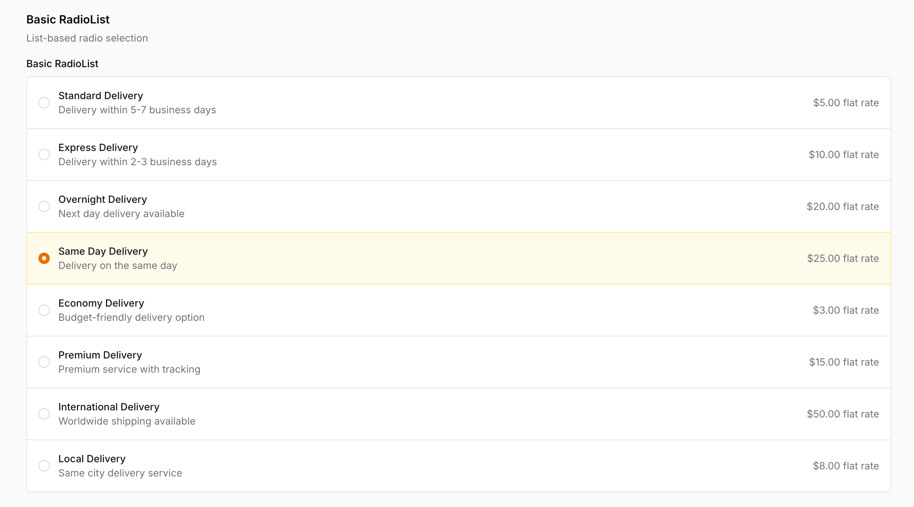
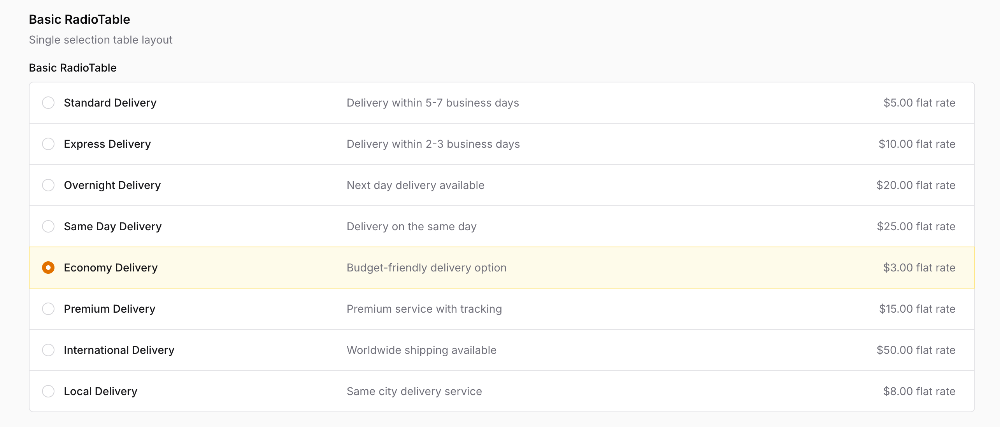
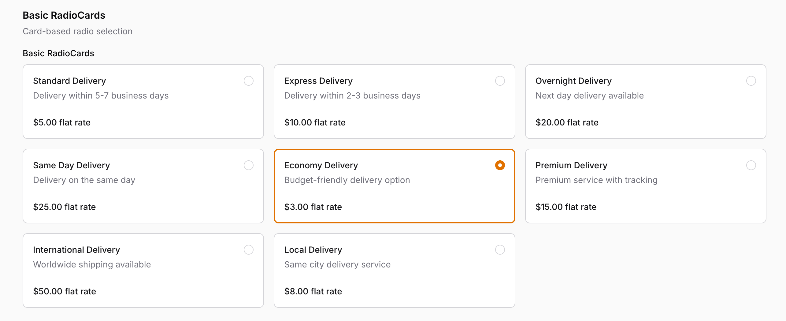
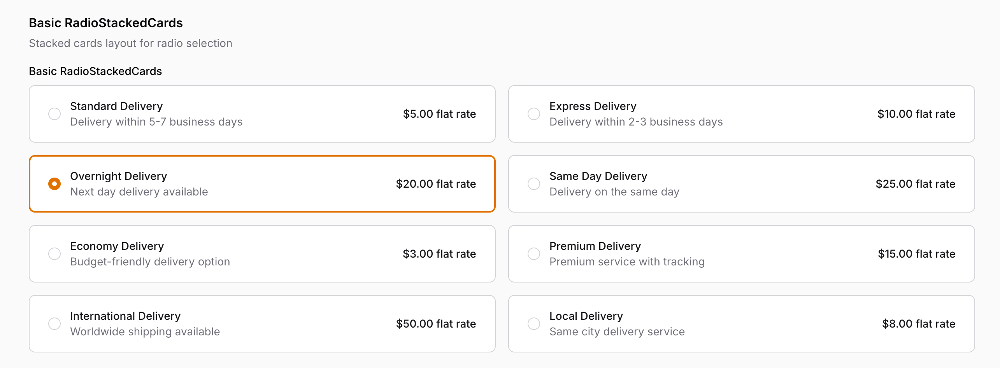

# Filament Advanced Choice

Enhance your **FilamentPHP 4** forms with 4 beautifully styled radio button components and 4 modern checkbox components. Each comes with user-friendly design to improve form usability and engagement.



## Licences
You can buy a license for the plugin on the [AnyStack](https://checkout.anystack.sh/filament-advanced-choice) website.

## Installation

Make sure you add the following repository to your `composer.json` file:

```json
{
    "repositories": [
        {
            "type": "composer",
            "url": "https://filament-advanced-choice.composer.sh"
        }
    ],
}
```

Then, run the following command to install the package:

```bash
composer require codewithdennis/filament-advanced-choice
```

To activate your license, use your email address as the username. For the password, you must enter your license key followed immediately by your activation fingerprint — both are required.

```bash 
Loading composer repositories with package information
Authentication required (filament-advanced-choice.composer.sh):
Username: info@codewithdennis.nl
Password: 8c210f8f-6173-3932-c4ba-8bcc723ef500:codewithdennis.nl
```

To clarify, the license key and fingerprint should be separated by a colon (:).

### Custom Theme

You will need to [create a custom theme](https://filamentphp.com/docs/3.x/panels/themes#creating-a-custom-theme) for the styles to be applied correctly.

Make sure you add the following to your `theme.css` file.

```bash
@source '../../../../vendor/codewithdennis/filament-advanced-choice/resources/**/*.blade.php';
```

## Components

### CheckboxList

Vertical list layout with descriptions for multiple selections.



```php
CheckboxList::make('delivery_type')
    ->searchable()
    ->bulkToggleable()
    ->options([
        'standard' => 'Standard Delivery',
        'express' => 'Express Delivery',
        'overnight' => 'Overnight Delivery',
        'same_day' => 'Same Day Delivery',
        'economy' => 'Economy Delivery',
        'premium' => 'Premium Delivery',
        'international' => 'International Delivery',
        'local' => 'Local Delivery',
    ])
    ->descriptions([
        'standard' => 'Delivery within 5-7 business days',
        'express' => 'Delivery within 2-3 business days',
        'overnight' => 'Next day delivery available',
        'same_day' => 'Delivery on the same day',
        'economy' => 'Budget-friendly delivery option',
        'premium' => 'Premium service with tracking',
        'international' => 'Worldwide shipping available',
        'local' => 'Same city delivery service',
    ])
    ->extras([
        'standard' => '$5.00 flat rate',
        'express' => '$10.00 flat rate',
        'overnight' => '$20.00 flat rate',
        'same_day' => '$25.00 flat rate',
        'economy' => '$3.00 flat rate',
        'premium' => '$15.00 flat rate',
        'international' => '$50.00 flat rate',
        'local' => '$8.00 flat rate',
    ]),
```

### CheckboxCards

Card-based layout with descriptions and extras support for multiple selections.



```php
CheckboxCards::make('delivery_type')
    ->searchable()
    ->bulkToggleable()
    ->options([
        'standard' => 'Standard Delivery',
        'express' => 'Express Delivery',
        'overnight' => 'Overnight Delivery',
        'same_day' => 'Same Day Delivery',
        'economy' => 'Economy Delivery',
        'premium' => 'Premium Delivery',
        'international' => 'International Delivery',
        'local' => 'Local Delivery',
    ])
    ->descriptions([
        'standard' => 'Delivery within 5-7 business days',
        'express' => 'Delivery within 2-3 business days',
        'overnight' => 'Next day delivery available',
        'same_day' => 'Delivery on the same day',
        'economy' => 'Budget-friendly delivery option',
        'premium' => 'Premium service with tracking',
        'international' => 'Worldwide shipping available',
        'local' => 'Same city delivery service',
    ])
    ->extras([
        'standard' => '$5.00 flat rate',
        'express' => '$10.00 flat rate',
        'overnight' => '$20.00 flat rate',
        'same_day' => '$25.00 flat rate',
        'economy' => '$3.00 flat rate',
        'premium' => '$15.00 flat rate',
        'international' => '$50.00 flat rate',
        'local' => '$8.00 flat rate',
    ]),
```

### CheckboxStackedCards

Stacked card layout with descriptions and extras support for multiple selections.



```php
CheckboxStackedCards::make('delivery_type')
    ->options(DeliveryTypeEnum::class)
    ->searchable()
    ->bulkToggleable(),
```

### CheckboxTable

Responsive table layout with descriptions for multiple selections.



```php
CheckboxTable::make('delivery_type')
    ->options(DeliveryTypeEnum::class)
    ->searchable()
    ->bulkToggleable(),
```

### RadioList

Vertical list layout with descriptions.



```php
RadioList::make('delivery_type')
    ->options(DeliveryTypeEnum::class),
```

### RadioTable

Responsive table layout with descriptions.



```php
RadioTable::make('delivery_type')
    ->options(DeliveryTypeEnum::class),
```

### RadioCards

Card-based layout with descriptions and extras support.



```php
RadioCards::make('delivery_type')
    ->options(DeliveryTypeEnum::class),
```

### RadioStackedCards

Stacked card layout with descriptions and extras support.



```php
RadioStackedCards::make('delivery_type')
    ->options(DeliveryTypeEnum::class),
```

## Additional Features

### Searchable Options

All checkbox components support searchable functionality to help users find options quickly in large lists.

```php
CheckboxList::make('delivery_type')
    ->options(DeliveryTypeEnum::class)
    ->searchable()
    ->searchPrompt('Search delivery types...')
    ->noSearchResultsMessage('No delivery types found.')
```

### Disabling Specific Options

You can disable specific options based on conditions using the `disableOptionWhen()` method.

```php
CheckboxList::make('delivery_type')
    ->options(DeliveryTypeEnum::class)
    ->disableOptionWhen(fn (string $value): bool => $value === 'premium')
```

### Bulk toggling checkboxes

Checkbox components support bulk select/deselect actions for better user experience.

```php
CheckboxList::make('delivery_type')
    ->options(DeliveryTypeEnum::class)
    ->bulkToggleable()
```

## Enum Support

You can use PHP enums with all components. When using enums, you need to implement Filament's `HasLabel` and `HasDescription` interfaces, plus the `HasExtra` interface from this package to provide labels, descriptions, and extras.

First, create your enum implementing the required interfaces:

<details>
<summary><strong>📋 Enum Implementation Code</strong></summary>

```php
<?php

declare(strict_types=1);

namespace App\Enums;

use CodeWithDennis\FilamentAdvancedChoice\Filament\Interfaces\HasExtra;use Filament\Support\Contracts\HasDescription;use Filament\Support\Contracts\HasLabel;

enum DeliveryTypeEnum: string implements HasDescription, HasExtra, HasLabel
{
    case Standard = 'standard';
    case Express = 'express';
    case Overnight = 'overnight';
    case SameDay = 'same_day';
    case Economy = 'economy';
    case Premium = 'premium';
    case International = 'international';
    case Local = 'local';

    public function getLabel(): string
    {
        return match ($this) {
            self::Standard => __('Standard Delivery'),
            self::Express => __('Express Delivery'),
            self::Overnight => __('Overnight Delivery'),
            self::SameDay => __('Same Day Delivery'),
            self::Economy => __('Economy Delivery'),
            self::Premium => __('Premium Delivery'),
            self::International => __('International Delivery'),
            self::Local => __('Local Delivery'),
        };
    }

    public function getDescription(): string
    {
        return match ($this) {
            self::Standard => __('Delivery within 5-7 business days'),
            self::Express => __('Delivery within 2-3 business days'),
            self::Overnight => __('Next day delivery available'),
            self::SameDay => __('Delivery on the same day'),
            self::Economy => __('Budget-friendly delivery option'),
            self::Premium => __('Premium service with tracking'),
            self::International => __('Worldwide shipping available'),
            self::Local => __('Same city delivery service'),
        };
    }

    public function getExtra(): ?string
    {
        return match ($this) {
            self::Standard => __('$5.00 flat rate'),
            self::Express => __('$10.00 flat rate'),
            self::Overnight => __('$20.00 flat rate'),
            self::SameDay => __('$25.00 flat rate'),
            self::Economy => __('$3.00 flat rate'),
            self::Premium => __('$15.00 flat rate'),
            self::International => __('$50.00 flat rate'),
            self::Local => __('$8.00 flat rate'),
        };
    }
}
```

</details>

Then use it in your form:

<details>
<summary><strong>📋 Form Usage Code</strong></summary>

```php
use App\Enums\DeliveryTypeEnum;
use CodeWithDennis\FilamentAdvancedChoice\Filament\Forms\Components\RadioStackedCards;

public static function configure(Schema $schema): Schema
{
    return $schema
        ->columns(1)
        ->components([
            RadioStackedCards::make('delivery_type')
                ->options(DeliveryTypeEnum::class),
        ]);
}
```

</details>

## Customization

### Input Visibility

Control whether the inputs are visible or hidden.

```php
CheckboxCards::make('delivery_type')
    ->options(DeliveryTypeEnum::class)
    ->hiddenInputs()
```

```php
CheckboxCards::make('delivery_type')
    ->options(DeliveryTypeEnum::class)
    ->visibleInputs()
```

### Colors

All components support custom colors using Filament's color system. The default color is `primary`, but you can customize it to any of Filament's supported colors.

#### Using Color Enums (Recommended)

```php
use Filament\Support\Colors\Color;

CheckboxCards::make('delivery_type')
    ->options(DeliveryTypeEnum::class)
    ->color(Color::Amber)
```

### Code Distribution
Licenses strictly prohibit the public distribution of its source code. This means you are not permitted to use Filament Advanced Choice to build an application and then distribute that application publicly through open-source repositories, hosting platforms, or any other code-sharing platforms.
